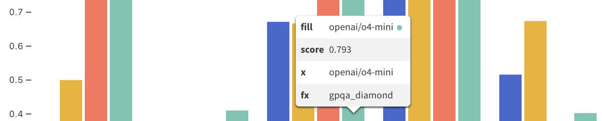
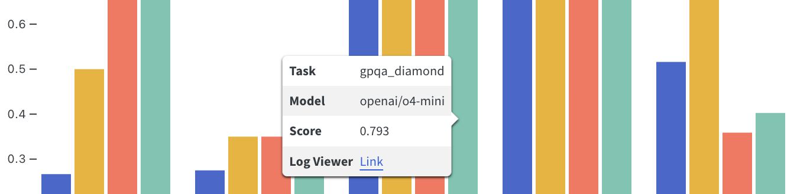
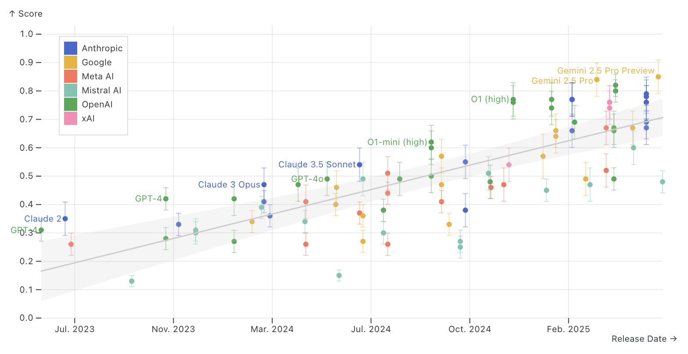
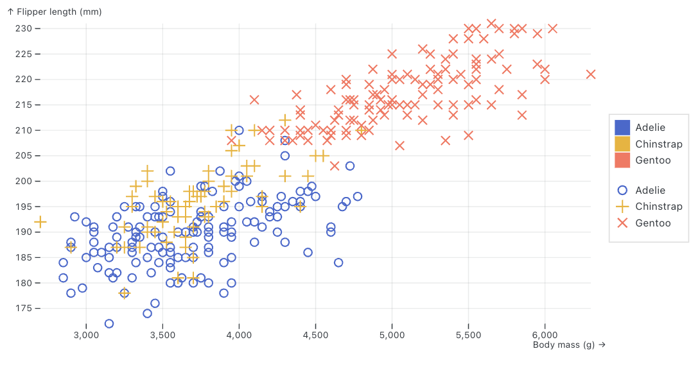

# Plots


A `plot()` produces a single visualisation and consists of one or more
*marks*—graphical primitives such as bars, areas, and lines—which serve
as chart layers. Each plot has a dedicated set of encoding *channels*
with named *scale* mappings such as `x`, `y`, `color`, `opacity`, etc.

Below we’ll describe the core semantics of plots and the various ways
you can customize them.

## Basics

Here is a simple dot plot that demonstrates some key concepts (click on
the numbers at right for additional details):

``` python
from inspect_viz import Data
from inspect_viz.plot import plot
from inspect_viz.mark import dot

penguins = Data.from_file("penguins.parquet")

plot(
    dot(penguins, x="body_mass", y="flipper_length",
        stroke="species", symbol="species"),
    legend="symbol",
    grid=True,
    width=700,
    height=400
)
```

Lines 8-9  
`dot()` mark for a simple dot plot, using a distinct `stroke` and
`symbol` to denote the “species” column.

Line 10  
Legend in the default location, keyed by `symbol`.

Lines 11-13  
Additional attributes that affect plot size and appearance.

## Facets

Plots support faceting of the `x` and `y` dimensions, producing
associated `fx` and `fy` scales. For example, here we compare model
performance on several tasks. The `task_name` is the `fx` scale,
resulting in a separate grouping of bars for each task:

``` python
from inspect_viz import Data
from inspect_viz.plot import plot, legend
from inspect_viz.mark import bar_y

evals = Data.from_file("evals.parquet")

plot(
    bar_y( 
        evals, x="model", fx="task_name",
        y="score_headline_value",
        fill="model",
        tip=True,
        channels={
            "Task": "task_name",
            "Model": "model",
            "Score": "score_headline_value",
            "Log Viewer": "log_viewer"
        }
    ),
    legend=legend("color", frame_anchor="bottom"),
    x_label=None, x_ticks=[], fx_label=None,
    y_label="score", y_domain=[0, 1.0]
)
```

Line 9  
Add an x-facet (“task_name”) using the `fx` option.

Line 20  
Define legend using `legend()` function (to enable setting `location`
and other options).

Line 21  
Remove default x labeling as it is handled by the legend.

Line 22  
Tweak y-axis with shorter label and ensure that it goes all the way up
to 1.0.

## Marks

The plots above use only a single mark (`dot()` and `bar_y()`
respectively). More sophisticated plots are often constructed with
multiple marks. For example, here is a plot that adds a regression line
mark do a standard dot plot:

``` python
from inspect_viz import Data
from inspect_viz.mark import dot, regression_y
from inspect_viz.plot import plot

athletes = Data.from_file("athletes.parquet")

plot(
    dot(
        athletes,
        x="weight", y="height",
        fill="sex", opacity=0.1
    ),
    regression_y(
        athletes, 
        x="weight", y="height", 
        stroke="sex"
    ),
    legend="color"
)
```

Lines 8,12  
Use `fill` to distinguish male and female athletes; use `opacity` to
deal with a large density of data points.

Lines 13,17  
Use `stroke` to ensure that male and female athletes each get their own
regression line.

## Tooltips

Tooltips enable you to provide additional details when the user hovers
their mouse over various regions of the plot. Tooltips are enabled
automatically for dot marks (`dot()`, `dot_x()`, `dot_y()`, `circle()`,
and `hexagon()`) and cell marks (`cell()`, `cell_x()`, etc.) and can be
enabled with `tip=True` for other marks. For example:

``` python
plot(
    bar_y( 
        evals, x="model", fx="task_name",
        y="score_headline_value",
        fill="model",
        tip=True
    ),
    legend=legend("color", frame_anchor="bottom"),
    x_label=None, x_ticks=[], fx_label=None,
    y_label="score", y_domain=[0, 1.0]
)
```

Line 6  
Add `tip=True` to enable tooltips for marks where they are not
automatically enabled.



Note that tooltips can interfere with plot interactions—for example, if
your bar plot was clickable to drive selections in other plots you would
not want to specify `tip=True`.

### Channels

As illustrated above, tooltips show all dataset channels that provide
scales (e.g. `x`, `y`, `fx`, `stroke`, `fill`, `symbol`, etc.). There
are a few things we do to improve on the default display:

1.  The labels are scale names rather than domain specific names
    (e.g. “fx” rather than “model”)
2.  The order of labels isn’t ideal.
3.  There are some duplicate values (e.g “fill” and “fx”)
4.  We might want to include additional columns not used in the rest of
    the plot (e.g. a link to the log file).

You can exercise more control over the tooltip by specifying `channels`
along with the mark. For example:

``` python
plot(
    bar_y( 
        evals, x="model", fx="task_name",
        y="score_headline_value",
        fill="model",
        tip=True,
        channels={
            "Task": "task_name", 
            "Model": "model",
            "Score": "score_headline_value",
            "Log Viewer": "log_viewer"
        }
    ),
    ...
)
```

Lines 7,12  
The `channels` option maps labels to columns in the underlying data—all
defined `channels` will appear in the tooltip. URL values are
automatically turned into links as shown here.



## Titles

Plot titles can be added using the `title` option. For example, here we
add a title at the top of the frame:

``` python
plot(
    dot(athletes, x="weight", y="height", fill="sex", opacity=0.1),
    regression_y(athletes, x="weight", y="height", stroke="sex"),
    title="Olympic Athletes",
    legend="color"
)
```

If you have facet labels on the top of the x-axis, you may need to
provide some additional `top_margin` for the `title` so that it is
placed above the facet labels. Use the `title()` function to customize
this:

``` python
from inspect_viz.mark import title

plot(
    ...
    title=title("Olympic Athletes", margin_top=40),
    ...
)
```

You can also customize the font size, weight, and family using the
`title()` function.

## Axes

There are several options available for controlling the domain, range,
ticks, and labels for axes.

### Labels

By default axes labels are taken from the columns they are mapped to.
Specify an `x_label` or `y_label` to override this:

``` python
plot(
    ...,
    x_label="release_date",
    y_label="score"
)
```

If you want no axes label at all, pass `None`. For example:

``` python
plot(
    ...,
    x_label=None
)
```

### Domain

By default, the x and y axes have a domain that matches the underlying
data. For example, if the data ranges from 0 to 0.8 the axes will
reflect this. Set a specific `x_domain` or `y_domain` to override this.
For example, here we specify that we want the y-axis to span from 0 to
1.0:

``` python
plot(
    ...,
    y_domain=[0,1.0]
)
```

You can also specify “fixed” for a domain, which will preserve the
domain of the initial values plotted. This is useful if you have created
filters for your data and you want the axes to remain stable across
filtering. For example:

``` python
plot(
    ...,
    y_domain="fixed"
)
```

### Ticks

You can explicitly control the axes ticks using the `x_ticks` and
`y_ticks` options. For example, here we specify ticks from 0 to 100 by
10:

``` python
plot(
    ...,
    x_ticks=range(0, 100, 10)
)
```

If you want no ticks at all specify `[]`, for example:

``` python
plot(
    ...,
    x_ticks=[]
)
```

There are several other tick related options. Here

- `[x,y]_tick_size` — The length of axis tick marks in pixels.

- `[x,y]_tick_rotate` — The rotation angle of axis tick labels in
  degrees clockwise.

- `[x,y]_tick_spacing` — The desired approximate spacing between
  adjacent axis ticks, affecting the default ticks.

- `[x,y]_tick_padding` — The distance between an axis tick mark and its
  associated text label.

- `[x,y]_tick_format` — How to format inputs for axis tick labels (a
  [d3-format](https://d3js.org/d3-format) or
  [d3-time-format](https://d3js.org/d3-time-format)).

## Legends

*Legends* can be added to `plot` specifications or included as
standalone elements:

``` python
from inspect_viz.plot import plot, legend

plot(
    ...,
    legend=legend("color")
)
```

Below we’ll describe the options used to position and style legends. See
the `legend()` function documentation for details on all legend options.

### Positioning

- Use `frame_anchor` to position the legend on a side or corner of the
  plot.
- Use `inset` to position the legend inside the plot area (use `inset_x`
  and `inset_y` to position more precisely)

For example, to place the legend inset in the top left, you could write:

``` python
legend("color", frame_anchor="top-left", inset=20)
```



### Legend Style

Legends are by default placed in a bordered box. Use the `border` and
`background` options to control box colors (specifying `False` to omit
border or background color). For example:

``` python
legend("color", border="blue", background="white")
```

### Multiple Legends

You may can pass multiple legends (strings like “color” or calls to
`legend()`) to the `plot()` funciton. Each may be positioned
independently using `frame_anchor` and `inset`, or if they share a
position, the legends will be merged into a container in that location.

For example, the following adds two legends in the same container in the
default position ( right of the plot):

``` python
plot(
    dot(penguins, x=x_axis, y=y_axis, stroke="species", symbol="species"),
    grid=True,
    x_label="Body mass (g) →",
    y_label="↑ Flipper length (mm)",
    legend=[legend("color"), legend("symbol")]
)
```



### Interactions

Legends also act as interactors, taking a bound `Selection` as a
`target` parameter. For example, discrete legends use the logic of the
`toggle` interactor to enable point selections. Two-way binding is
supported for Selections using *single* resolution, enabling legends and
other interactors to share state.

See the docs on [Toggle](components-interactivity.qmd#toggle)
interactors for an example of an interactive legend.

### Legend Name

The `name` directive gives a `plot` a unique name. A standalone legend
can reference a named plot `legend(..., for_plot="penguins")` to avoid
respecifying scale domains and ranges.

## Baselines

Baselines can be including `baseline()` marks in the plot definition (or
by including them in the `marks` option of pre-built
[views](views.qmd)).

For example, here we add a baseline with the median weight from the
athletes data:

``` python
from inspect_viz.mark import baseline
from inspect_viz.transform import median, sql
plot(
    dot(athletes, x="weight", y="height", fill="sex", opacity=0.1),
    baseline(70),
    regression_y(athletes, x="weight", y="height", stroke="sex"),
    legend="color"
)
```

If you have a simple static baseline, you may simply provide the value,
along with other options to customize the label, position, and other
attributes of the baseline. You can also use a tranformation function
like `median()` to define baselines:

``` python
from inspect_viz.mark import title

plot(
    ...
    baseline(
        median("weight"), 
        data=athletes, 
        label="Median", 
        label_position="middle", 
        color="red"),
    ...
)
```

By default, baselines are drawn using the x-axis values. To draw a
baseline using the y-axis values, pass `orientation="y"` to the baseline
function.

## Margins

Since the text included in axes lables is dynamic, you will often need
to adjust the plot margins to ensure that the text fits properly within
the plot. Use the `margin_top`, `margin_left`, `margin_right`, and
`margin_bottom` options to do this. Note that there are also
`facet_margin_top`, `facet_margin_left`, etc. options available.

For example, here we set a `margin_left` of 100 pixels to ensure that
potentially long model names have room to display:

``` python
plot(
    data,
    bar_y(...),
    margin_left=100
)
```

## Colors

Use the `color_scheme` option to the `plot()` function to pick a theme
(see the `ColorScheme` reference for available schemes). Use the
`color_range` option to specify an explicit set of colors. For example,
here we use the “tableau10” `color_scheme`:

``` python
plot(
    bar_y( 
        evals, x="model", fx="task_name",
        y="score_headline_value",
        fill="model",
    ),
    legend=legend("color", frame_anchor="bottom"),
    x_label=None, x_ticks=[], fx_label=None,
    y_label="score", y_domain=[0, 1.0],
    color_scheme="tableau10"
)
```

## Data

In the examples above we made `Data` available by reading from a parquet
file. We can also read data from any Python Data Frame (e.g. Pandas,
Polars, PyArrow, etc.). For example:

``` python
import pandas as pd
from inspect_viz import Data

# read directly from file
penguins = Data.from_file("penguins.parquet")

# read from Pandas DF (i.e. to preprocess first)
df = pd.read_parquet("penguins.parquet")
penguins = Data.from_dataframe(df)
```

You might wonder why is there a special `Data` class in Inspect Viz
rather than using data frames directly? This is because Inpsect Viz is
an interactive system where data can be dynamically filtered and
transformed as part of plotting—the `Data` therefore needs to be sent to
the web browser rather than remaining only in the Python session. This
has a couple of important implications:

1.  Data transformations should be done using standard Python Data Frame
    operations *prior* to reading into `Data` for Inspect Viz.

2.  Since `Data` is embedded in the web page, you will want to filter it
    down to only the columns required for plotting (as you don’t want
    the additional columns making the web page larger than is
    necessary).

### Selections

One other important thing to understand is that `Data` has a built in
*selection* which is used in filtering operations on the client. This
means that if you want your inputs and plots to stay synchoronized, you
should pass the same `Data` instance to all of them (i.e. import into
`Data` once and then share that reference). For example:

``` python
from inspect_viz import Data
from inspect_viz.plot import plot
from inspect_viz.mark import dot
from inspect_viz.input import select
from inspect_viz.layout import vconcat

# we import penguins once and then pass it to select() and dot()
penguins = Data.from_file("penguins.parquet")

vconcat( 
   select(penguins, label="Species", column="species"),
   plot(
      dot(penguins, x="body_mass", y="flipper_length",
          stroke="species", symbol="species"),
      legend="symbol",
      color_domain="fixed"  
   )
)
```

## SQL

You can use the `sql()` transform function to dynamically compute the
values of channels within plots. For example, here we dynamically add a
`bias` parameter to a column:

``` python
from inspect_viz import Data, Param
from inspect_viz.input import slider
from inspect_viz.layout import vconcat
from inspect_viz.mark import area_y
from inspect_viz.plot import plot
from inspect_viz.transform import sql

random_walk = Data.from_file("random-walk.parquet")
bias = Param(100)

vconcat(
    slider(label="Bias", target=bias, min=0, max=1000, step=1),
    plot(
        area_y(
            random_walk, 
            x="t", 
            y=sql(f"v + {bias}"), 
            fill="steelblue"
        )
    )
)
```

Any valid SQL expression can be used. For example, here we use an `IF`
expression to set the stroke color based on a column value:

``` python
stroke=sql(f"IF(task_arg_hint, 'blue', 'red')")
```

## Dates

### Numeric Values

In some cases your plots will want to deal with date columns as numeric
values (e.g. for plotting a regression line). For this case, use the
`epochs_ms()` transform function to take a date and turn it into a
timestampm (milliseconds since the epoch). For example:

``` python
from inspect_viz.mark import regression_y
from inspect_viz.transform import epoch_ms

regression_y(
    evals, 
    x=epoch_ms("model_release_date"), 
    y="score_headline_value", 
    stroke="#AAAAAA"
)
```

Note that when doing this you’ll also want to apply formatting to the
tick labels so they appear as dates (the next section covers how to do
this).

### Tick Formatting

Use the tick format attributes (e.g. `x_tick_format` and
`y_tick_format`) to specify the formatting for date columns on tick
labels. For example:

``` python
plot(
    ...,
    x_tick_format="%b. %Y"
)
```

You can specify any [d3-time-format](https://d3js.org/d3-time-format) as
the tick format.

### Reductions

In some cases you may have timeseries data which you’d like to reduce
across months or years (e.g.collapse year values to enable comparison
over months only). The following transformations can be used to do this:

|  |  |
|----|----|
| `date_day()` | Transform a Date value to a day of the month for cyclic comparison. Year and month values are collapsed to enable comparison over days only. |
| `date_month()` | Transform a Date value to a month boundary for cyclic comparison. Year values are collapsed to enable comparison over months only. |
| `date_day_month()` | Map date/times to a month and day value, all within the same year for comparison. |

## Attributes

*Attributes* are plot-level settings such as `width`, `height`, margins,
and scale options (e.g., `x_domain`, `color_range`, `y_tick_format`).
Attributes may be `Param`-valued, in which case a plot updates upon
param changes.

Some of the more useful plot attribues include:

- `width`, `height`, and `aspect_ratio` for controlling plot size.

- `margin` and `facet_margin` (and more specific margins like
  `margin_top`) for controlling layout margins.

- `style` for providing CSS styles.

- `aria_label` and `aria_description`, `x_aria_label`,
  `x_aria_description`, etc. for accessibilty attributes.

- `x_domain`, `x_range,`y_domain`, and`y_range\` for controlling the
  domain and range of axes.

- Tick settings for `x`, `y`, `fx`, and `fy` axes (e.g. `x_ticks`,
  `x_tick_rotate`, etc.)

- `r` (radius) scale settings (e.g. `r_domain`, `r_range`, `r_label`,
  etc.)

See `PlotAttributes` for documentation on all available plot attributes.
