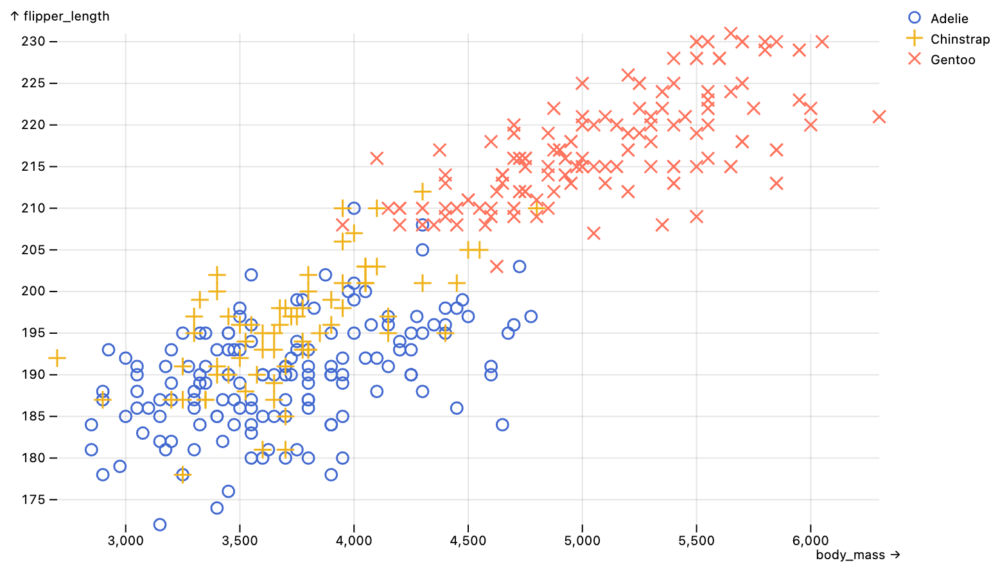

# Plots


## Overview

There are several ways to publish plots created with Inspect Viz:

1.  Use the `write_png()` function to create an image for use in a
    document or presentation.

2.  Use the `write_html()` function to create a standalone HTML file.

3.  Create and share a Jupyter notebook with the plot.

4.  Embed the plot in a website or dashboard.

This article will cover the first two options for sharing standalone
plots—the [Notebooks](publishing-notebooks.qmd),
[Websites](publishing-websites.qmd), and
[Dashboards](publishing-dashboards.qmd) articles will cover the other
possibilities.

## Plot as Image

Use the `write_png()` function to save a PNG version of any plot.

> [!NOTE]
>
> The `write_png()` function requires that you install the
> [playwright](https://playwright.dev/python/) Python package, which
> enables taking screenshots of web graphics using an embedded version
> of the Chromium web browser. You can do this as follows:
>
> ``` bash
> pip install playwright
> playwright install
> ```

To create a plot and export it as a PNG:

``` python
from inspect_viz import Data
from inspect_viz.mark import dot
from inspect_viz.plot import plot, write_png

penguins = Data.from_file("penguins.parquet")

pl = plot(
    dot(penguins, x="body_mass", y="flipper_length",  
        stroke="species", symbol="species"),
    legend="symbol",
    grid=True
)

write_png("penguins.png", pl)
```

Here is the plot that was written (note that since this plot is a static
PNG file rather than a JavaScript widget it does not have tooltips):



### Plot Size

You can control the size of the image written by specifying the `width`
and `height` directly in the call to `plot()`. For example:

``` python
pl = plot(
    dot(penguins, x="body_mass", y="flipper_length",  
        stroke="species", symbol="species"),
    legend="symbol",
    grid=True,
    width=900,
    height=400
)
```

### Export Options

There are a couple of other options that can be used when exporting
plots to PNG:

| Option | Description |
|----|----|
| `scale` | Device scale to capture plot at. Use 2 (the default) for retina quality images suitable for high resolution displays or print output) |
| `padding` | Padding (in pixels) to add around exported plot. Defaults to 8 pixels. |

## Plot as HTML

You can also create an HTML version of a plot using the `write_html()`
function. For example:

``` python
from inspect_viz import Data
from inspect_viz.mark import dot
from inspect_viz.plot import plot, write_html

penguins = Data.from_file("penguins.parquet")

pl = plot(
    dot(penguins, x="body_mass", y="flipper_length",  
        stroke="species", symbol="species"),
    legend="symbol",
    grid=True
)

write_html("penguins.html", pl)
```

Unlike with `write_png()`, the exported HTML plot retains all
interactive features (tooltips, filters, etc.). In some cases you might
therefore also include [inputs](components-inputs.qmd) with your plot.
For example:

``` python
pl = vconcat(
   select(penguins, label="Species", column="species"),
   plot(
      dot(penguins, x="body_mass", y="flipper_length",  
          stroke="species", symbol="species"),
      legend="symbol",
      color_domain="fixed"
   )
)

write_html("penguins.html", pl)
```
