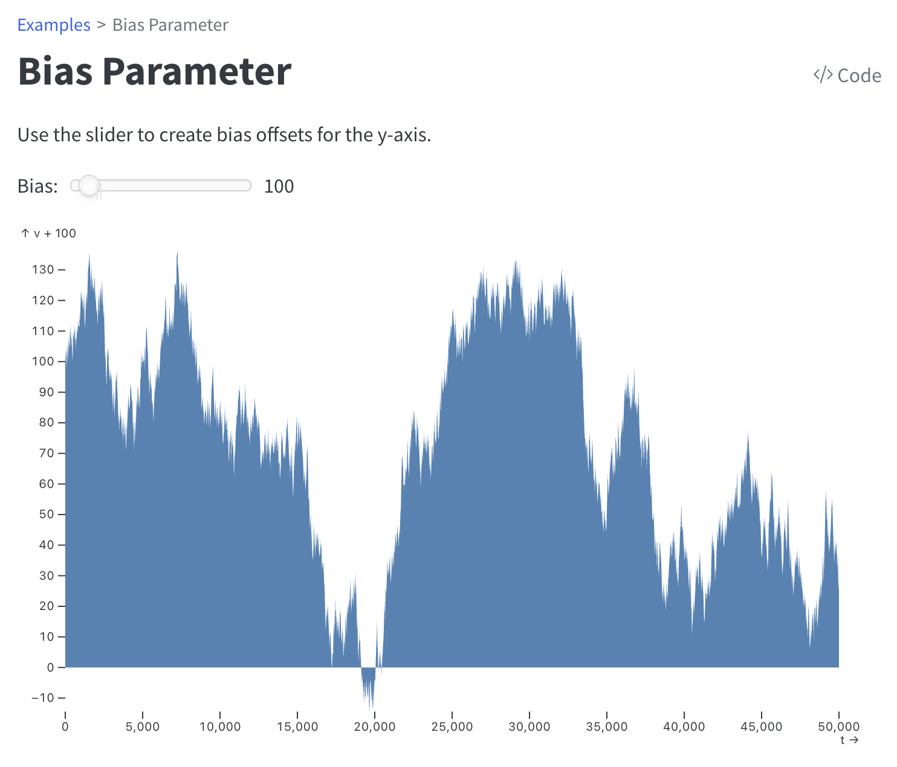

# Websites


## Overview

If you want to publish one or more plots as part of a website there are
a couple of high level orientations to the problem:

1.  Use a Jupyter-based website publishing system that supports
    interactive Jupyter Widgets (e.g. [Quarto](https://quarto.org)).

2.  Use the `to_html()` function to create embeddable HTML fragments for
    your plots and embed them in any website.

We’ll cover both of these approaches below.

## Quarto Websites

The [Quarto](https://quarto.org) publishing system can create websites
that include dynamic output from Python code, including interactve
Jupyter Widgets like the ones created by Inspect Viz. To install the
`quarto-cli` Python package:

``` bash
pip install quarto-cli
```

Quarto is a markdown-based publishing system that enables you to embed
executable Python blocks whose output is included in the published
website. For instance, Here is the source code for the [Bias
Parameter](examples/general/bias-parameter/index.qmd) example:

```` python
---
title: "Bias Parameter"
echo: false
---

Use the slider to create bias offsets for the y-axis.

```{python}
from inspect_viz import Data, Param
from inspect_viz.input import slider
from inspect_viz.mark import area_y
from inspect_viz.plot import plot
from inspect_viz.transform import sql

random_walk = Data.from_file("random-walk.parquet")
bias = Param(0)
```

```{python} 
slider(label="Bias", target=bias, min=0, max=1000, step=1, value=100)
```

```{python} 
plot(area_y(random_walk, x="t", y=sql(f"v + {bias}"), fill="steelblue"))
```
````

Line 3  
We specify `echo: false` to prevent display of code blocks.

Lines 8-17  
Markdown code blocks decorated with `{python}` are executed.

Here is what the page looks like when rendered on the website (it’s a
screenshot so you won’t be able to use the slider!):



### Notebook Execution

When using Inspect Viz with Quarto Websites you should always add the
following configuration to your `_quarto.yml` to specify that notebooks
should be fully executed when rendered:

**\_quarto.yml**

``` yaml
execute: 
  enabled: true
```

### Learning More

The website was created with Quarto and includes many live Inspect Viz
plots and tables. The source code for the
[Examples](https://github.com/meridianlabs-ai/inspect_viz/tree/main/docs/examples)
section is a good place to start to understand the basics.

The documentation on [Quarto
Websites](https://quarto.org/docs/websites/) includes a tutorial and
many additional details on creating, customizing, and publishing
websites.

[Quarto Dashboards](publishing-dashboards.qmd) are a special type of
Quarto website optimized for displaying many plots and tables together,
so are also worth considering.

## HTML Fragments

If you are working with an existing website or with another website
publishing system, it is also straightforward to embed HTML snippets
which include Inspect Viz plots and tables.

### Single Plot

To create a standalone snippet which you can include in any website, use
the `write_html()` function:

``` python
from inspect_viz import Data
from inspect_viz.mark import dot
from inspect_viz.plot import plot, write_html

penguins = Data.from_file("penguins.parquet")

pl = plot(
    dot(penguins, x="body_mass", y="flipper_length",  
        stroke="species", symbol="species"),
    legend="symbol",
    grid=True
)

write_html("penguins.html", pl)
```

### Multiple Plots

If you want to include multiple plots on a page, you might find it more
convenient to call the `to_html()` function as part of your website
generation process. The returned HTML includes the Jupyter Widget
runtime dependencies, so if you have multiple plots you’ll instead want
to include these dependencies once in the `<head>` of your document and
the create HTML snippets without the dependencies.

Here is the dependencies code that you should place in the `<head>` tag:

``` html
<script src="https://cdn.jsdelivr.net/npm/requirejs@2.3.6/require.min.js" crossorigin="anonymous"></script>
<script src="https://cdn.jsdelivr.net/npm/@jupyter-widgets/html-manager@^1.0.1/dist/embed-amd.js" crossorigin="anonymous"></script>
```

Then, specify `dependencies=False` when you call `to_html()` to get only
the plot and not the dependencies scripts which are already in your
`<head>` tag:

``` python
from inspect_viz.plot import to_html

pl = plot(
    dot(penguins, x="body_mass", y="flipper_length",  
        stroke="species", symbol="species"),
    legend="symbol",
    grid=True
)

pl_html = to_html(pl, dependencies=False)

# ...include pl_html in your website
```
